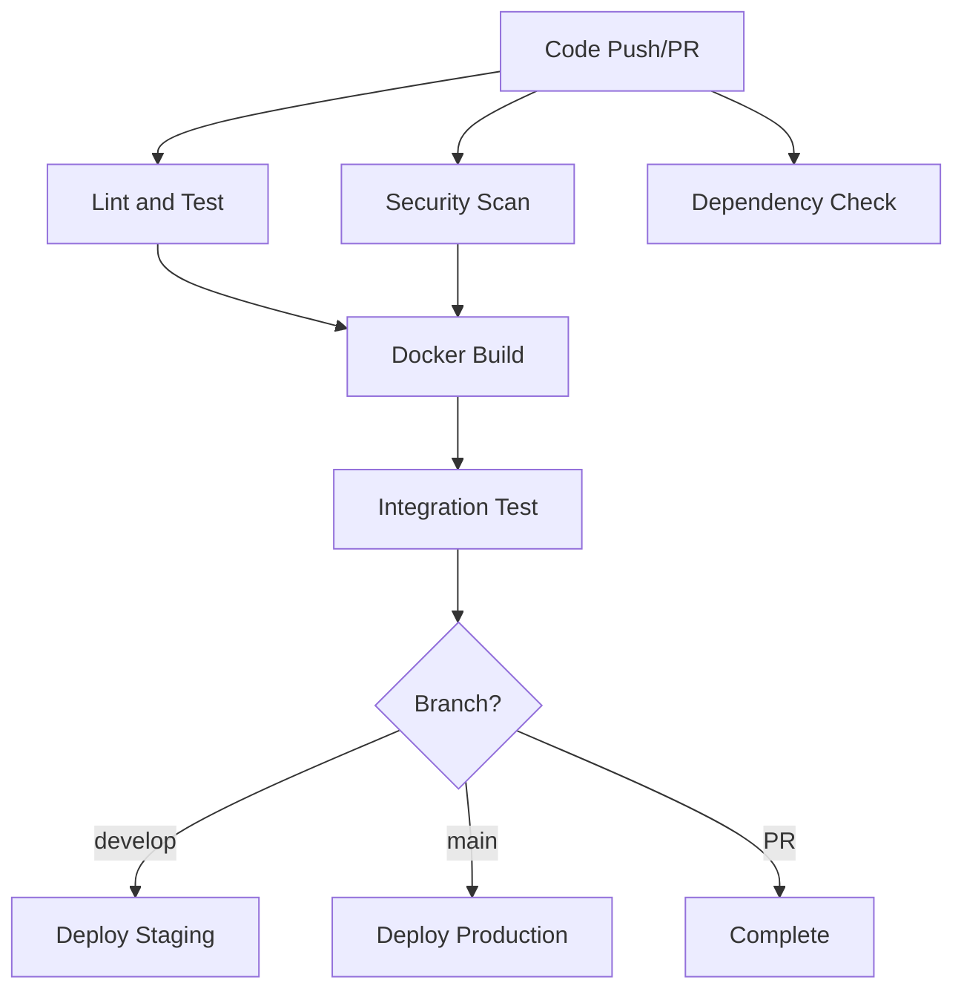

# CI/CD Pipeline Documentation

## Overview

This repository includes a comprehensive GitHub Actions CI/CD pipeline that ensures code quality, security, and reliable deployments for the Jar3d Meta Expert application.

## Pipeline Structure

### 🔍 **Lint and Test Job**
- **Python Setup**: Uses Python 3.11 with pip caching
- **Dependencies**: Installs all requirements plus development tools
- **Playwright**: Installs browsers for web scraping tests
- **Code Quality Checks**:
  - `flake8`: Python linting and syntax checking
  - `black`: Code formatting verification
  - `isort`: Import sorting verification
- **Testing**: Runs pytest with coverage reporting
- **Coverage**: Uploads coverage reports to Codecov

### 🔒 **Security Scan Job**
- **Safety**: Checks for known security vulnerabilities in dependencies
- **Bandit**: Static security analysis for Python code
- **Reports**: Generates and uploads security scan artifacts

### 🐳 **Docker Build Job**
- **Multi-platform**: Builds for linux/amd64 and linux/arm64
- **Registry**: Pushes images to GitHub Container Registry
- **Caching**: Uses GitHub Actions cache for faster builds
- **Testing**: Validates Docker image functionality
- **Tagging**: Automatic tagging based on branch/PR

### 🔍 **Dependency Check Job**
- **Trivy Scanner**: Comprehensive vulnerability scanning
- **SARIF Upload**: Integrates with GitHub Security tab
- **File System Scan**: Checks all project files for vulnerabilities

### 🧪 **Integration Test Job**
- **Service Dependencies**: Runs NLM-ingestor service
- **End-to-End Testing**: Tests complete application workflow
- **Environment Variables**: Uses secure secrets for API keys

### 🚀 **Deployment Jobs**
- **Staging**: Auto-deploys develop branch to staging environment
- **Production**: Auto-deploys main branch to production environment
- **Environment Protection**: Uses GitHub environments for approval workflows

## Configuration Files

### `pytest.ini`
- Test discovery and execution configuration
- Coverage reporting settings
- Async test support
- Warning filters

### `pyproject.toml`
- **Black**: Code formatting configuration
- **isort**: Import sorting rules
- **Coverage**: Coverage measurement settings
- **Bandit**: Security scanning configuration

### `.flake8`
- Linting rules and exclusions
- Line length and style preferences
- File-specific ignore rules

## Environment Variables and Secrets

### Required Secrets (GitHub Repository Settings)
```
ANTHROPIC_API_KEY    # Anthropic API access
OPENAI_API_KEY       # OpenAI API access  
SERPER_API_KEY       # Serper search API access
NEO4J_URI           # Neo4j database connection
NEO4J_USERNAME      # Neo4j authentication
NEO4J_PASSWORD      # Neo4j authentication
LANGCHAIN_API_KEY   # LangSmith tracing (optional)
```

### Environment-Specific Variables
- **Staging**: Uses test/development API keys
- **Production**: Uses production API keys and configurations

## Triggering the Pipeline

### Automatic Triggers
- **Push to main**: Full pipeline + production deployment
- **Push to develop**: Full pipeline + staging deployment  
- **Pull Requests**: Full pipeline (no deployment)

### Manual Triggers
- **workflow_dispatch**: Manual pipeline execution via GitHub UI

## Pipeline Stages Flow



## Local Development

### Running Tests Locally
```bash
# Install development dependencies
pip install -r requirements.txt
pip install pytest pytest-cov pytest-asyncio flake8 black isort

# Run linting
flake8 .
black --check .
isort --check-only .

# Run tests
pytest --cov=. --cov-report=html

# Install Playwright browsers
playwright install
```

### Docker Testing
```bash
# Build image
docker build -t jar3d-local .

# Run container
docker run -p 8105:8105 \
  -e OPENAI_API_KEY=your_key \
  -e SERPER_API_KEY=your_key \
  jar3d-local
```

## Monitoring and Alerts

### GitHub Actions
- **Status Badges**: Add to README for build status visibility
- **Notifications**: Configure GitHub notifications for failed builds
- **Branch Protection**: Require CI success before merging

### Security Monitoring
- **Dependabot**: Automated dependency updates
- **Security Advisories**: GitHub security alerts
- **SARIF Integration**: Security findings in GitHub Security tab

## Troubleshooting

### Common Issues

1. **Playwright Installation Failures**
   - Ensure sufficient disk space
   - Check browser installation logs
   - Verify system dependencies

2. **Docker Build Timeouts**
   - Increase timeout values
   - Optimize Dockerfile layers
   - Use build cache effectively

3. **Test Failures**
   - Check environment variable setup
   - Verify service dependencies
   - Review test isolation

4. **Security Scan False Positives**
   - Update bandit configuration
   - Add specific ignore rules
   - Document security exceptions

### Performance Optimization

- **Parallel Jobs**: Most jobs run in parallel for speed
- **Caching**: Pip, Docker, and GitHub Actions caching enabled
- **Conditional Execution**: Deployment jobs only run on specific branches
- **Artifact Management**: Automatic cleanup of old artifacts

## Contributing

When contributing to this project:

1. **Code Quality**: Ensure all linting checks pass
2. **Tests**: Add tests for new functionality
3. **Security**: Run security scans locally
4. **Documentation**: Update this README for pipeline changes

## Pipeline Metrics

Track these metrics for pipeline health:
- **Build Success Rate**: Target >95%
- **Build Duration**: Target <15 minutes
- **Test Coverage**: Target >80%
- **Security Issues**: Target 0 high/critical